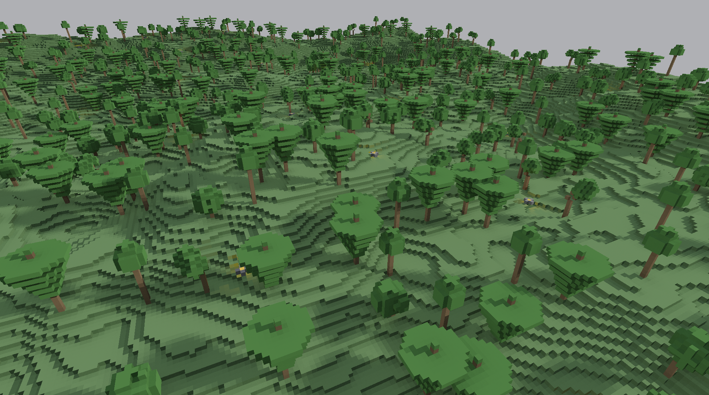
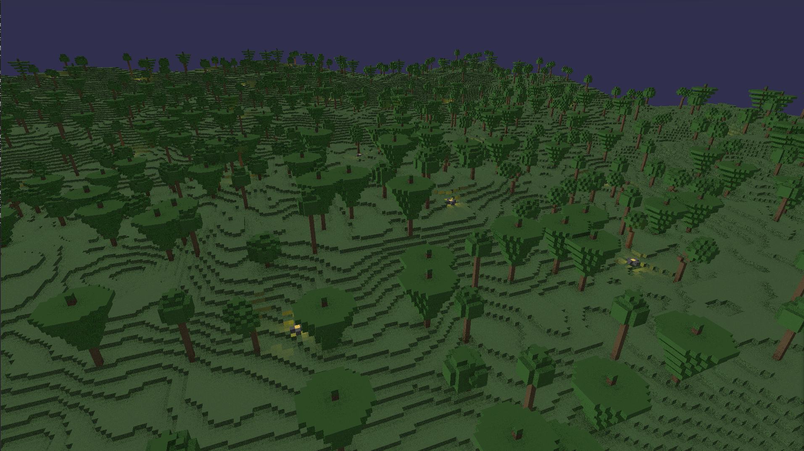
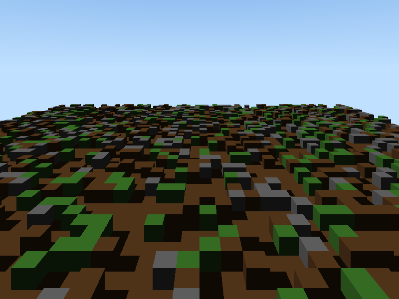

<div align="center">

# Voxel Ray Tracer

**Real-time GPU path tracing through 67 million voxels — built from scratch in CUDA.**

No game engine. No graphics framework. Every ray computed by hand.

</div>

---

<div align="center">

| Daytime | Night |
|---|---|
|  |  |

</div>

---

## Overview

Each pixel fires ~9 rays per frame through a procedurally generated 512×512×256 world at 1920×1080. Soft shadows, hemisphere ambient occlusion, one-bounce global illumination, and campfire point lights — all computed in a single CUDA kernel. Stand still and the temporal accumulator progressively refines the image to near noise-free in under 2 seconds.

---

## Rendering Pipeline

**Per pixel, per frame:**

- **Primary ray** — DDA traversal (Amanatides-Woo) up to 1500 steps through 67M voxels
- **Soft shadows** — 3 jittered rays toward the sun, producing a natural penumbra
- **Hemisphere AO** — 4 cosine-weighted short-range rays that darken enclosed corners
- **One-bounce GI** — a secondary ray lets surfaces exchange color; grass tints the underside of leaves, campfire glow bounces off nearby stone
- **Point lights** — campfires with inverse-square attenuation and full shadow occlusion
- **Reinhard tonemap + gamma 2.2** — HDR to display, no blown-out highlights
- **Temporal accumulation** — progressive running mean resets on camera movement, converges when still

---

## World Generation

<div align="center">


*Early build — terrain generation before trees, AO, or lighting*

</div>

The world is generated at startup entirely from noise — no assets, no files loaded.

- **Terrain** — 6-octave value noise, height-mapped to biomes: sand below the waterline, grass on plains, snow above the treeline
- **Trees** — 4 hand-crafted archetypes placed across grass tiles:
  - **Oak** — round jittered-sphere canopy with a slight lean
  - **Pine** — tall layered cone with 5 stacked ring tiers
  - **Birch** — slim trunk, small oval crown
  - **Twisted** — irregular multi-stem with two offset leaf clusters
- **Campfires** — scattered across the world with stone rings, each one a live point light

---

## Architecture

```
main.cu          — game loop, camera, day/night, block editing, benchmarks
renderer.cuh     — renderKernel, DDA, soft shadows, AO, GI, temporal accum
world.cuh        — VoxelGrid, terrain gen, tree placement, campfire placement
camera.cuh       — Ray / Camera structs, generateRay
light.cuh        — Light struct (directional)
math_utils.cuh   — float3 operators: dot, cross, normalize, lerp
vk_display.h/cpp — Vulkan window + swapchain (GLFW), zero-render-pass pipeline
output.h/cpp     — PNG export via stb_image_write
```

The display pipeline skips the render pass entirely — the kernel writes RGBA8 to a staging buffer which is copied directly into the swapchain image each frame via `vkCmdCopyBufferToImage`.

---

## Build

**Requirements**
- CUDA 12.6 — *12.x specifically; CUDA 13.x has a known nvcc Windows compiler crash*
- VS 2022 Build Tools with the MSVC C++ workload
- GLFW 3
- Vulkan SDK

**Compile** (Developer PowerShell for VS 2022)

```powershell
nvcc -arch=sm_89 -std=c++17 -O2 -Xcompiler "/MD" -o voxel_rt main.cu vk_display.cpp `
  -I"C:/path/to/glfw/include" `
  -I"C:/VulkanSDK/x.x.x.x/Include" `
  "C:/path/to/glfw/lib/glfw3.lib" `
  "C:/VulkanSDK/x.x.x.x/Lib/vulkan-1.lib" `
  gdi32.lib user32.lib shell32.lib
```

| GPU Generation | `-arch` flag |
|---|---|
| RTX 40-series | `sm_89` |
| RTX 30-series | `sm_86` |
| RTX 20-series | `sm_75` |

---

## Controls

| Input | Action |
|---|---|
| `W` / `S` | Move forward / back |
| `A` / `D` | Strafe left / right |
| Mouse | Look around |
| Left click | Place block |
| Right click | Remove block |

---

## Performance

Tested on RTX 4070 Super at 1920×1080.

| Mode | Behavior |
|---|---|
| Moving | Single noisy sample per pixel — real-time response |
| Still | Accumulates across frames — clean GI in ~1–2 seconds |

Benchmark output prints every 60 frames to stdout: kernel time, frame time, fps, and Mrays/s. Session summary on exit.

---

## Why

I wanted to understand how ray tracing actually works — not by calling a library, but by writing every piece: the traversal math, the lighting equations, the Vulkan frame delivery, the noise functions, the tree shapes. Everything on screen is computed from first principles, every frame.
